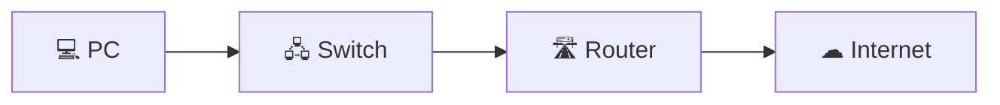
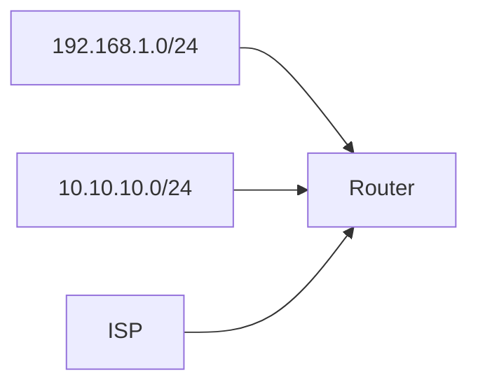
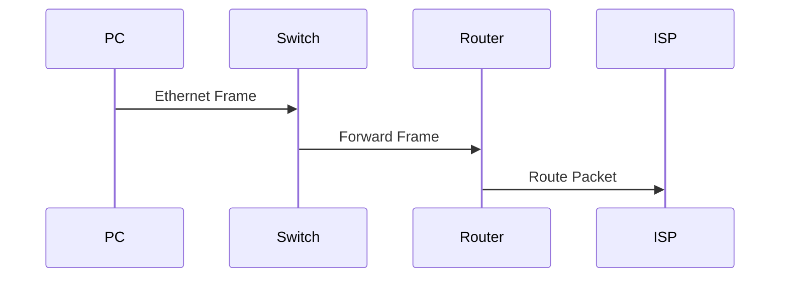

# Chapter 1.1.a — Routers

> **CCNA 200-301 v1.1 Study Guide**

---

## Exam Objective

Explain the role and function of routers.

---

# Learning Objectives

After completing this chapter, you should be able to:

- Explain what a router is.
- Describe the purpose of a router.
- Explain how routers forward packets.
- Understand the concept of a default gateway.
- Identify common router interfaces.
- Read a basic routing table.
- Differentiate between static and dynamic routing.
- Understand Administrative Distance (AD).
- Explain the packet forwarding process.
- Use common Cisco IOS router commands.

---

# What Is a Router?

A **router** is a network device that connects **different IP networks** together.

Think of a router like a highway intersection.

Cars travel on roads until they reach an intersection. The intersection decides which road they should take next.

A router performs the same function for network traffic.

Instead of cars, it forwards **IP packets**.

Instead of roads, it connects networks.

Examples include:

- Home networks
- Office networks
- School campuses
- Internet Service Providers (ISPs)
- The Internet

---

## Router Overview



The router's job is simple:

> **Determine where every packet should go next.**

---

# What Does a Router Do?

Every packet contains two important IP addresses:

| Field | Example |
|--------|----------|
| Source IP | 192.168.1.10 |
| Destination IP | 8.8.8.8 |

When a packet reaches the router, it looks at **only the destination IP address** to decide where to forward the packet.

---

# Router vs Switch

| Switch | Router |
|---------|---------|
| Uses MAC addresses | Uses IP addresses |
| Connects devices in one LAN | Connects different networks |
| Layer 2 device | Layer 3 device |
| Learns MAC addresses | Learns IP routes |
| Cannot reach other networks alone | Connects to remote networks and the Internet |

---

# OSI Layer

Routers operate at **Layer 3 (Network Layer).**

```text
OSI Model

7  Application
6  Presentation
5  Session
4  Transport
----------------------
3  Network      ← Router
----------------------
2  Data Link    ← Switch
1  Physical
```

### CCNA Exam Tip

If the question mentions:

- Routing
- IP addresses
- Best path
- Forwarding packets

The correct answer usually involves **Layer 3**.

---

# Every Router Connects Multiple Networks

Each router interface belongs to a **different network**.



Example:

| Interface | Network |
|------------|----------|
| G0/0 | 192.168.1.0/24 |
| G0/1 | 10.10.10.0/24 |
| S0/0 | ISP |

---

# Router Interfaces

Common Cisco interfaces include:

| Interface | Purpose |
|------------|----------|
| GigabitEthernet | Modern LAN connections |
| FastEthernet | Older LAN connections |
| Serial | WAN connections |
| Loopback | Virtual testing interface |

Example Cisco interface names:

```text
GigabitEthernet0/0

GigabitEthernet0/1

GigabitEthernet1/0
```

Naming format:

```text
Interface Type / Slot / Port
```

Example:

```text
GigabitEthernet0/1

GigabitEthernet
        │
        ├── Slot 0
        └── Port 1
```

---

# Router IP Addresses

Every router interface requires its own IP address.

| Interface | Address |
|------------|----------|
| G0/0 | 192.168.1.1/24 |
| G0/1 | 10.10.10.1/24 |

Because these addresses belong to different subnets, the router can forward packets between them.

---

# How Packets Travel



Every time a packet arrives, the router:

1. Reads the destination IP.
2. Searches the routing table.
3. Finds the best route.
4. Sends the packet out the correct interface.

---

# Default Gateway

One of the most important CCNA concepts.

A **default gateway** is the router a host sends packets to whenever the destination is **outside the local subnet**.

Example PC configuration:

| Setting | Value |
|----------|-------|
| IP Address | 192.168.1.25 |
| Subnet Mask | 255.255.255.0 |
| Default Gateway | 192.168.1.1 |

Diagram:

```text
         Router
     192.168.1.1
          ▲
          │
 Default Gateway
          │
      192.168.1.25
```

Without a default gateway:

✅ Local communication works.

❌ Internet access fails.

❌ Remote networks cannot be reached.

### Memory Trick

> **The default gateway is the door that leaves your neighborhood.**

---

# Routing Table

Every router maintains a **routing table**.

Think of it as a GPS for networks.

Example:

| Destination Network | Next Hop | Interface |
|---------------------|----------|-----------|
| 192.168.1.0/24 | Connected | G0/0 |
| 10.10.10.0/24 | Connected | G0/1 |
| 0.0.0.0/0 | ISP | S0/0 |

---

# Longest Prefix Match

When multiple routes match, routers choose the **most specific route**.

Example:

| Route | Prefix |
|---------|--------|
| 10.0.0.0/8 | General |
| 10.10.0.0/16 | More specific |
| 10.10.5.0/24 | Most specific |

Destination:

```text
10.10.5.55
```

Selected route:

```text
10.10.5.0/24
```

### Remember

The router always chooses the route with the **longest prefix length**.

---

# Connected Routes

When an IP address is configured on an interface and the interface is enabled, Cisco IOS automatically installs a connected route.

Configuration:

```cisco
interface GigabitEthernet0/0
 ip address 192.168.1.1 255.255.255.0
 no shutdown
```

Routing table:

```text
C 192.168.1.0/24 is directly connected
```

---

# Static Routes

A static route is manually configured.

Example:

```cisco
ip route 172.16.0.0 255.255.0.0 10.1.1.2
```

Meaning:

> To reach **172.16.0.0/16**, forward packets to **10.1.1.2**.

### Advantages

- Easy to understand
- Predictable
- Secure
- No routing protocol overhead

### Disadvantages

- Manual configuration
- Poor scalability
- Must be updated manually

---

# Dynamic Routing

Dynamic routing protocols automatically exchange routing information.

Protocols covered by the CCNA:

| Protocol | CCNA Coverage |
|------------|--------------|
| OSPF | Yes |
| RIP | Recognition only |
| EIGRP | Basic understanding |
| BGP | Recognition only |

Dynamic routing allows routers to:

- Learn new routes
- Recover from failures
- Automatically update routing tables

---

# Administrative Distance (AD)

Sometimes multiple routing sources advertise the same destination.

Administrative Distance determines which source is trusted.

Lower values are preferred.

| Route Source | AD |
|---------------|----|
| Connected | 0 |
| Static | 1 |
| eBGP | 20 |
| EIGRP | 90 |
| OSPF | 110 |
| RIP | 120 |

Example:

A router learns the same network from:

- Static Route (AD 1)
- OSPF (AD 110)

The static route is installed because **1 is lower than 110**.

---

# Packet Forwarding Process

```text
                 Packet Arrives
                       │
                       ▼
        Read Destination IP Address
                       │
                       ▼
          Search Routing Table
                       │
                       ▼
      Longest Prefix Match Found?
             │                 │
            Yes               No
             │                 │
             ▼                 ▼
      Select Best Route   Default Route?
             │                 │
             ▼                 ▼
 Rewrite Layer 2 Header   Yes → Use Default Route
             │                 │
             ▼                 ▼
 Send Out Interface     No → Drop Packet
```

---

# Layer 2 Rewriting

A router does **not** forward Ethernet frames unchanged.

At every hop it:

1. Removes the incoming Layer 2 frame.
2. Reads the Layer 3 packet.
3. Chooses an outgoing interface.
4. Creates a brand-new Layer 2 frame.
5. Sends the packet.

### Important

| Field | Changes? |
|---------|----------|
| Source MAC | ✅ Yes |
| Destination MAC | ✅ Yes |
| Source IP | ❌ No |
| Destination IP | ❌ No |

---

# Common Cisco IOS Commands

| Command | Purpose |
|-----------|----------|
| `show ip route` | Display routing table |
| `show ip interface brief` | Display interface summary |
| `show interfaces` | View interface statistics |
| `show running-config` | Display active configuration |
| `show version` | Display IOS version |
| `configure terminal` | Enter configuration mode |
| `interface g0/0` | Select an interface |
| `ip address` | Configure an IP address |
| `no shutdown` | Enable an interface |
| `ip route` | Configure a static route |

---

# Real-World Example

```text
Laptop
192.168.1.20
      │
      ▼
Home Router
192.168.1.1
      │
      ▼
Internet
      │
      ▼
Google
142.250.x.x
```

The laptop determines Google is not on the local subnet.

It sends the packet to the default gateway.

The router checks its routing table.

The packet is forwarded to the ISP.

Each router repeats the same process until the packet reaches Google's network.

---

# Common CCNA Mistakes

| Incorrect | Correct |
|------------|---------|
| Routers use MAC addresses for routing. | Routers use IP addresses. |
| Switches replace routers. | Switches connect devices on the same LAN. |
| Default gateways are only for Internet traffic. | Default gateways are used for **all remote networks**. |
| Routers forward Ethernet frames unchanged. | Routers rebuild the Layer 2 frame every hop. |
| The shortest prefix wins. | The **longest prefix match** wins. |

---

# Chapter Summary

You should now understand:

- Routers connect different IP networks.
- Routers operate at Layer 3.
- Routers forward packets based on destination IP addresses.
- Every router interface belongs to a separate network.
- Hosts use a default gateway to reach remote networks.
- Routers consult a routing table before forwarding packets.
- The longest prefix match determines the best route.
- Routes may be connected, static, or dynamically learned.
- Administrative Distance selects the most trusted routing source.
- Layer 2 headers change at every router hop.

---

# CCNA Exam Essentials

✅ Router = Layer 3 device

✅ Connects different networks

✅ Uses IP addresses

✅ Uses routing tables

✅ Default gateway reaches remote networks

✅ Longest prefix match chooses the best route

✅ Administrative Distance selects the most trusted routing source

✅ Connected routes have AD 0

✅ Static routes have AD 1

✅ MAC addresses change at every router hop

✅ IP addresses normally remain unchanged while routing
